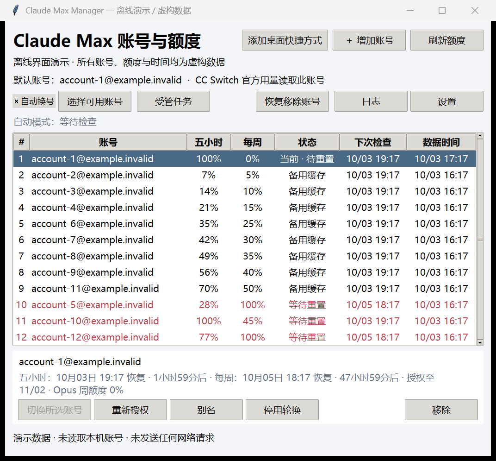

# Claude Max Manager · 账号与额度

Windows 本地桌面工具，用于管理通过官方 Claude Code 登录的多个 Max 账号、查看额度和接续受管任务。Python 标准库实现，无需第三方代理。



> 截图来自真实界面的离线演示：邮箱、额度及时间均为虚构数据，不包含真实账号或凭据。本项目为非官方工具，与 Anthropic 无隶属关系。

## 安装与启动

需要 Windows 10/11、Python 3.10+（含 Tkinter）、官方 Claude Code 和自己的 Max 账号。

```powershell
git clone https://github.com/2666fff/claude-max-manager.git
cd claude-max-manager
claude auth login
python manager.py
```

首次使用前先完成一个账号的官方登录，工具会将其登记为第一个账号。后续账号使用界面中的“＋ 增加账号”。需要隐藏 Python 控制台时，可执行 `pythonw manager.py`。

从 IDE 或代理工具的受管进程组启动时，入口会通过 Windows 已有的桌面进程重新启动，避免宿主退出时一并结束管理器。再次启动已有实例只会恢复窗口。独立启动需要当前 Windows 桌面与资源管理器可用；桌面启动失败会明确报错。显式设置的 `CLAUDE_CODE_EXECUTABLE` 路径会传给独立实例。

工具自动查找用户目录下的原生安装、npm 安装或 PATH 中的 `claude.exe`。其他安装位置可指定：

```powershell
$env:CLAUDE_CODE_EXECUTABLE = 'C:\path\to\claude.exe'
python manager.py
```

无需 `pip install`。`Enroll-Accounts.ps1` 是最初的四账号批量授权辅助入口，一般使用桌面界面即可。

## 功能

- **账号管理**：增加账号、官方重新授权、别名、停用自动选择、移除和恢复。重复账号拒绝加入，重授权身份不一致时恢复原配置。
- **纵向排行**：每个账号一行，当前账号置顶，其余按启用状态和已用比例排列。列表显示五小时、每周额度、状态及检查时间；选中后在下方查看完整恢复时间并切换、授权、改名或移除。截图使用 12 个虚构账号展示布局。
- **额度**：五小时、每周及官方返回的模型额度，已用比例、恢复时间、查询时间。当前默认账号随机每 5–8 分钟查询；备用账号缓存展示，到重置时间或需要换号时校验。耗尽且未重置的账号不重复请求，失败遵守退避。
- **授权状态**：显示已知授权期限；实际查询或切换时按需刷新访问令牌。授权撤销需要重新登录；临时网络错误、403、429不会误报为授权撤销。运行中的默认账号交由官方 CLI 管理刷新。
- **运行中手动切换**：无需重启已验证版本的 Claude Code。备份并事务更新身份和 OAuth 凭据，保留其他凭据及配置，通过官方 `auth status` 校验；失败回滚。新凭据对后续请求生效。
- **自动换号**：勾选后，在阈值、周额度、模型额度、数据新鲜度、账号启用状态及冷却期都满足时选择备用账号；兼容版本的普通 CLI 运行中也能切换。所有账号耗尽时等待恢复。
- **受管任务**：单独启动的任务监控器，在官方 CLI 明确报告额度错误并退出后，选择可用账号，恢复同一会话。普通错误和权限问题停止；正常完成后不再自动提交。只有该方式启动的任务可自动接续。
- **设置与日志**：阈值、查询间隔、切换冷却和额度筛选模型；事件日志不保存令牌或任务内容。
- **桌面与托盘**：一键添加桌面快捷方式；最小化或关闭窗口后进入 Windows 系统托盘，后台监控继续运行。点击图标恢复，右键菜单可打开主窗口或退出。

## 使用

1. 点“＋ 增加账号”，在官方网页授权后自动加入列表。
2. Windows Claude Code **2.1.288** 可选中账号，再点击“切换所选账号”，不用退出当前会话。后续请求读取新账号；已发出的请求仍使用原账号。其他版本尚未通过本项目实测，运行中会拒绝切换，退出 Claude 后仍可切换。
3. “自动换号”默认开启，默认阈值 **99%**。查询到当前账号五小时、每周或已配置模型窗口达到 99% 时，选择额度数据有效、已启用且低于阈值的最佳备用账号。99% 及以上的切换不受旧冷却期和最小额度差额阻挡；没有可用账号则等待。已有明确保存的设置保持原值，可在“设置”中修改。
4. 需要无人值守接续时，打开“受管任务”，确认项目目录、会话 ID、任务指令和官方权限模式。接续旧任务先退出原 Claude；监控器也会等待其他 Claude 进程退出。运行输出显示在独立终端中，“停止”只中断它自己启动的进程。
5. 授权被撤销时选中该账号，再点击下方“重新授权”；额度用完不等于授权失效。
6. 点击顶部“添加桌面快捷方式”，在 Windows 实际桌面（含重定向/OneDrive 桌面）创建启动入口；再次点击会更新同名快捷方式。
7. 最小化和右上角关闭均隐藏到托盘，与自动换号是否开启无关。点击托盘图标或再次运行桌面快捷方式即可恢复窗口；完全退出请右键托盘图标选择“退出”。图标可能在任务栏的折叠区域中。

退出管理器会等待正在进行的额度查询或账号写入完成。官方授权尚未结束时，会先提示完成或关闭授权窗口。退出不终止用户的 Claude Code 或独立受管任务；管理器的自动监控随退出停止。

Claude Code 自身的 `/login` 可以在当前进程中重新登录。本工具无需模拟 `/login`：在官方刷新锁和配置锁保护下原子替换凭据，让 Claude Code 自己重读。已用同一个官方 CLI 进程验证成功，而不只是查看 `auth status` 的账号名称。详见 [实现与验证记录](docs/hot-switch.md)。

**热切换不等于自动重发消息。** 如果普通终端已经因额度报错停在输入框，换号后仍需重新发送“继续”；工具不向现有终端注入输入。需要错误后自动恢复任务时使用“受管任务”。它保留自己的账号选择权，运行期间手动切换和桌面自动换号不会与其争用。切换默认账号影响共享默认凭据的会话；独立 `CLAUDE_CONFIG_DIR` 或环境变量指定令牌的会话不属于此范围。自动切换不会增加账号额度，没有可用账号时无法继续推理。

## 数据与实现

账号、设置、日志、缓存和备份位于 `%USERPROFILE%\.claude-max-accounts`；默认凭据位于 `%USERPROFILE%\.claude`，身份配置位于 `%USERPROFILE%\.claude.json`。这些目录含敏感凭据，不要上传分享。移除会归档账号，方便恢复；不撤销官方授权。参阅 [私密数据说明](SECURITY.md)。

- `core.py`：账号存储、官方身份校验、事务切换与回滚。
- `enhanced.py`：令牌刷新、互斥锁、刷新结果恢复、额度缓存和调度。
- `manager.py`：桌面入口和官方授权界面。
- `desktop.py`：原生 Windows 托盘、单实例窗口恢复、桌面快捷方式。
- `runner.py`：受管任务进程、限额识别、同会话恢复及停止。
- `test_features.py`：隔离测试，使用虚构凭据，不触碰真实账号。

无需 Docker、WSL 或第三方代理；不修改 CC Switch 数据库。托盘使用标准库 `ctypes` 调用 Windows API，无新增 Python 依赖，支持资源管理器重启后的图标恢复。当前没有开机自启动。若进程异常退出留下锁目录，工具会报告占用，不会擅自抢占凭据写锁。

## 验证范围

执行 `python -m unittest -v test_features`。自动选择、限频退避、授权错误分类、刷新结果恢复、凭据字段保留、进程保护、移除恢复、真实 CLI 限额事件结构均有隔离测试。

完整测试：`python -m unittest -v test_features test_desktop test_lifecycle test_schedule`，共 38 项通过。桌面测试使用虚构账号，实际创建窗口和托盘，检查隐藏、最小化、恢复以及等待写入后退出；不会读取真实账号或发送网络请求。覆盖纵向排行与选中账号操作、随机截止时间持久化、备用账号不轮询、多项耗尽等待最后重置、到期后查询、过期候选校验、托盘后台刷新及换号、异常恢复和限频退避。生命周期测试实际关闭测试进程组，确认普通子进程退出、独立启动的子进程继续运行，并验证突然退出的识别、日志脱敏及真实主循环退出清理。原生右键菜单“退出”和桌面 `.lnk` 目标也已单独实测。

实际完成：五账号官方额度查询；使用隔离凭据执行官方 CLI 切换校验；受管任务等待原进程及响应停止；本机 2.1.288 的真实限额响应采样；桌面界面检查。18 项隔离测试通过，包含 99% 临界值和冷却/额度差额不阻挡的策略验证。

当前默认账号每次成功查询后，随机抽取 300–480 秒作为下一次间隔，并将截止时间保存到缓存；本地检查不会反复抽取。可在设置中调整最短和最长间隔。旧固定间隔设置由新的随机范围替代，其他设置保留。官方限频时仍遵守 Retry-After 和退避。99% 策略在取得有效查询结果后触发，不能保证捕捉恰好 99% 的瞬间；单个请求也可能用完最后的额度，因此不能保证绝不中断。

备用账号首次没有额度数据时查询一次，此后使用缓存；未到官方重置时间时不做周期查询，需要切换时校验超过十分钟的旧数据。已耗尽的五小时、每周或选定模型窗口尚未重置时，自动、手动刷新和受管任务都跳过额度请求，也不为该请求刷新令牌；多个耗尽窗口按最后一个阻挡使用的恢复时间等待。不猜测缺失或没有时区的重置时间。手动“刷新额度”可以查询未耗尽的备用账号，仍遵守缓存和限频。

桌面程序每秒仅检查本地到期时间，到期后才调用额度查询；缓存和官方 Retry-After 仍由查询层统一执行。相邻查询批次至少间隔 30 秒，正在授权或切换时等待操作完成。窗口隐藏到托盘不影响检查；电脑休眠期间不能查询，恢复后检查已到期的账号。列表显示缓存状态、等待重置原因和下次检查时间。

界面“检查完成”不代表每个账号刚从官方取得新额度，请以列表中的“数据时间”为准。每轮在本地日志记录 `quota_cycle`（新查询数、有效账号数），回调异常记录 `monitor_error`（仅异常类型，不记录原始异常内容）。查询失败不会把旧额度作为可切换依据；定时检查和队列处理不会因单次异常永久停止。

“日志”窗口也显示本地运行诊断。`manager-runtime.json` 记录启动、每 30 秒的主循环心跳、正常/异常退出及异常类型和代码位置；原生故障栈保存在 `manager-fault.log`，上次记录保留一份。异常消息、局部变量和凭据不写入诊断。若进程突然被系统或外部工具终止，来不及记录退出，下次启动会记录 `manager_unclean_exit`；这个事件本身不能证明是 Python 崩溃。诊断只保存在本机账号目录，不提交到仓库。

**不重启切换实测通过：** 在同一 PID、同一会话中，以可用账号请求成功，切到耗尽账号后收到真实 `rate_limit`，再切回可用账号后请求成功。另一次测试在一轮任务的工具调用阶段切换，后续推理同样采用新凭据。使用的就是桌面工具调用的 `Store.switch(..., allow_running=True)`，不是单独的替代实现。全局身份及凭据的前后哈希一致。

```powershell
python validate_hot_switch.py --available-slot 2 --exhausted-slot 1
python validate_hot_switch.py --available-slot 2 --exhausted-slot 1 --during-tool
```

上述为手工真实验收，会消耗少量额度。默认在隔离目录禁用工具；`--during-tool` 仅开放 `sleep` 命令，需本机 Claude 可使用 Bash。

**跨账号接续实测通过：** 在临时配置中，用一次注入的旧额度数据启动已耗尽的测试账号；官方 CLI 返回真实额度错误；同一个 runner 随后校验并切到可用测试账号，以原会话 ID 恢复，成功返回 `OK`，会话记录落盘。测试使用官方安全模式并禁用工具，临时凭据随后删除；全局身份及凭据的前后哈希一致。它证明额度错误后的恢复路径，不代表复杂任务的每个副作用都能自动重试。

`validate_managed_live.py` 为手工验收脚本，会消耗少量真实额度；须明确指定已耗尽和有额度的账号槽位：

```powershell
python validate_managed_live.py --exhausted-slot 1 --available-slot 2
```

**仍未完成的真实验收：** OAuth 刷新端点实测返回过 403/429，冷却后重试仍是 429，尚未得到真实刷新成功响应。自动刷新代码已接入并有隔离测试；暂不能承诺长期无人值守授权续期。凭据不被错误覆盖，临时限频与授权撤销分开显示。

## 参考

参考项目的协议处理和账号管理思路，结合本机官方 CLI 的实际响应独立实现：

- [claude-swap](https://github.com/realiti4/claude-swap)
- [switch_claude_account](https://github.com/countzero/switch_claude_account)
- [claude-account-switcher](https://github.com/KrzysztofZander/claude-account-switcher)

实现参考不代替实测；本工具的热切换结论仅覆盖上述已验证环境和请求路径。

## 生成脱敏截图

```powershell
python tools/capture_demo.py
```

此命令仅使用临时目录、虚构账号和离线数据渲染真实界面，不读取真实账号目录，不调用额度或授权接口。输出 `docs/screenshots/dashboard.png`。
